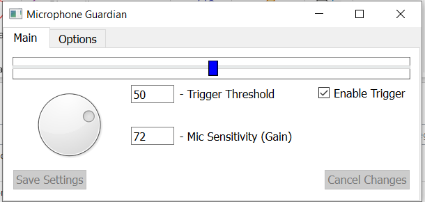

# Gaming Voice Guardian

Gaming Voice Guardian is a tool designed to measure your microphone volume and play an alarm sound if you or anyone else speaks too loudly.

## Download 

You can download the latest release of Gaming Voice Guardian [here](https://github.com/Novecento99/gaming-voice-guardian/releases/download/v1/soundMonitor.exe).

## Graphical Interface

## Contributing

Pull requests and issues are welcome! If you encounter any bugs, please feel free to submit them. If you would like to contribute to the improvement of this tool, make a few commits and create a pull request. Thank you! 😊

Gabriele L.